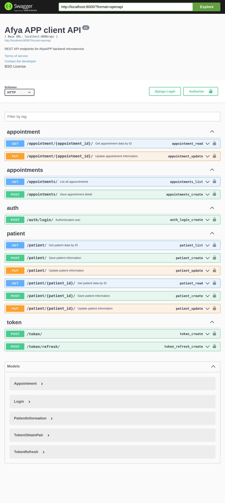

## AFYA APP
This is a simple fullstack web application that can be used to register patients to a facility and capture patients basic/vital information on each visits.

## About Project
This application is built in two servers. 
1. Client server - Vite+React and Bootstrap for UI
2. Backend server - Django, DRF SQLite and PostgreSQL for development production environments respectively.

### USERS
At a highlevel this application supports or is configured to support upto 2 user roles.

- Health care provider i.e could be doctor, nurse or the hospital administrator
    Health care provider is registered on the backend and can one can only interacat with the app upon successfull login.
- SuperAdmin Admin

### View ports/routes

- Authentication
- [x] Login page.
    This interface enables an already registered health care provider to be authorized and given access rights into the application.

- Navigation
- [x] Dashboard.
    On successfull login, the user is redirected to their dashboard.
    A healthcare provider can update their profile information with email an excemption since email is the unique identifier.
- [x] Patient registration.
    A health care provider can is able to register and capture personal information and visit/appointment information.
- [x] Patient records.
    A health care provider can view a table summary of all patients in that facility.
    Patient's data is summarized by their full name, age and BMI status. 
    Rule of thumb, Patients;
    1.  BMI > 18.5 are underweight
    2.  Normal patients have a BMI > 18.5 < 25
    3.  BMI > 25 overweight 

### Endpoints
- Authentication enabled with simple-jwt in DRF
- Documented with swaggerUI
### Sample endpoints

    
## Technologies used
#### Frontend(client)
- Vite React + JS
- Bootstrap

#### Backend(server)
- Django and PostgreSQL database.
- Django rest framework.